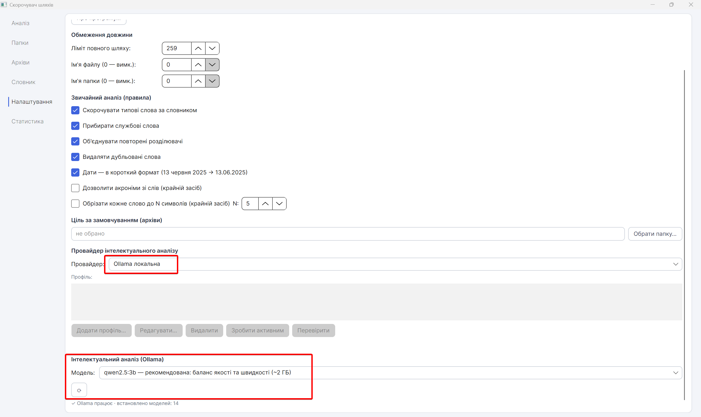

# PathShortener — Скорочувач шляхів

[](LICENSE)


**🇺🇦 Українська** · [🇬🇧 English](#-english)

Інструмент для Windows, що розпаковує архіви (ZIP/7z/RAR) та впорядковує папки,
**заздалегідь скорочуючи назви файлів і папок** так, щоб повний шлях кожного запису
вписався в ліміт довжини (типово **259 символів**, MAX_PATH − 1). Це усуває помилку
«Довжина імен файлів перевищує дозволену в папці призначення» під час розпакування
глибоко вкладених архівів державних документів, судових справ тощо.

> Семантику назв («як коротко й зрозуміло») підказує локальна або хмарна ШІ-модель,
> а **бюджет довжини, колізії та журнал відповідностей рахує детермінований код** —
> тож результат відтворюваний і безпечний.

## Скриншоти / Screenshots

**Аналіз — попередній перегляд плану / Analysis — plan preview**


**Папки / Folders**


**Словник / Dictionary**


**Налаштування / Settings**


**Правила звичайного аналізу / Standard analysis rules**


**Статистика / Statistics**


---

## Можливості

**Джерела та режими**
- Розпакування **архівів** ZIP / 7z / RAR (через 7-Zip) зі скороченням шляхів.
- Обробка **папок з диска** з усіма вкладеними: перейменування **на місці** або
  копіювання зі скороченими іменами в іншу теку (оригінал недоторканий).
- Індивідуальна ціль для кожного джерела; вмикання/вимикання джерел чекбоксом.

**Розумне й безпечне скорочення**
- **Звичайний аналіз** без ШІ — за правилами й словником усталених абревіатур
  (ВРП, КМУ, КСУ…); налаштовувані правила (стоп-слова, дублікати, розділювачі тощо).
- **Інтелектуальний аналіз** — за допомогою моделі; до неї йдуть лише унікальні
  сегменти, що реально перевищують ліміти (повтори групуються — економія токенів).
- **Дати недоторканні** — `09_01_2025`, `21.04.2021`, «13 червня 2025» тощо
  вирізаються ще до моделі й повертаються назад; обрізання ніколи не зрізає дату.
- **ПІБ недоторканні** — прізвища з ініціалами (`ЛЕВЧУК_О_О_…`) не скорочуються й
  не надсилаються моделі; штучні абревіатури з імен заборонені **кодом**, не промптом.
- Окремі ліміти на довжину імені файлу, імені папки та повного шляху.
- Локальна валідація відповідей моделі: не приймається порожнє, те, що не зменшує
  довжину, недопустимі символи чи «випадкові» акроніми.

**ШІ-провайдери**
- **Ollama** (локальна й віддалена), **Claude**, **OpenAI**, **Grok**, **Gemini**.
- Кілька профілів на кожного провайдера; **API-ключі шифруються (Windows DPAPI)**,
  у відкритому вигляді не зберігаються; ключі різних провайдерів незалежні.
- Попередження перед платним API; нейтральне сповіщення для віддаленої Ollama.
- Вбудоване керування локальною Ollama: перевірка статусу, вибір/завантаження
  моделі, запуск сервера, встановлення Ollama.

**Контроль і прозорість**
- Таблиця попереднього перегляду плану з **ручним редагуванням** нових назв.
- **Каскадна зміна папок**: правка однакової папки застосовується до всіх шляхів.
- **Детектор конфліктів** (дублікати, недопустимі/зарезервовані/порожні імена,
  наявні на диску об'єкти) — критичні конфлікти блокують застосування.
- **Менеджер словника**: перегляд, редагування, затвердження LLM-скорочень.
- **Журнал відповідностей** (CSV) — записується до застосування (зворотність).
- **Журнал виконання** (`execution.log`) — без API-ключів.
- Вкладка **«Статистика»**: джерела, шляхи, модель, виклики, токени.

**Інтерфейс**
- Сучасний Avalonia-інтерфейс, вкладки: Аналіз / Папки / Архіви / Словник /
  Налаштування / Статистика.
- Теми: **світла** (за замовчуванням), **темна** (м'яка графітова), **системна**.
- Дві мови інтерфейсу: **українська** (за замовчуванням) та **англійська**.
- Кнопка **«Зупинити»** коректно перериває виконання.

---

## Встановлення (для користувачів)

1. Відкрийте [**Releases**](https://github.com/teraxis/PathShortener/releases).
2. Завантажте один із варіантів:
   - **`PathShortener-portable.zip`** (~44 МБ) — самодостатній, працює без .NET;
   - **`PathShortener-compact.zip`** (~26 МБ) — легший, потребує
     [.NET 8 Desktop Runtime](https://dotnet.microsoft.com/download/dotnet/8.0).
3. Розпакуйте й запустіть `PathShortener.exe`.

**Вимоги:**
- Windows 10/11.
- [**7-Zip**](https://www.7-zip.org/) — для роботи з архівами (якщо не в `PATH`,
  вкажіть шлях через змінну `PATHSHORTENER_7Z` або файл `7z.txt` поряд з .exe).
- Для інтелектуального аналізу — [**Ollama**](https://ollama.com/) з моделлю
  (напр. `qwen2.5:3b`) або API-ключ одного з хмарних провайдерів. Без них працює
  звичайний аналіз за правилами.
- Для шляхів понад 260 символів: `LongPathsEnabled = 1` у
  `HKLM\SYSTEM\CurrentControlSet\Control\FileSystem` (разом із маніфестом застосунку).

---

## Збірка з коду (для розробників)

```bash
git clone https://github.com/teraxis/PathShortener.git
cd PathShortener

# тести ядра — має вивести «✔ УСІ ІНВАРІАНТИ ВИКОНАНО»
dotnet run --project src/PathShortener.Verify

# запуск інтерфейсу
dotnet run --project gui/PathShortener.Gui.csproj

# самодостатній .exe (працює без .NET)
dotnet publish gui/PathShortener.Gui.csproj -c Release -r win-x64 \
  -p:PublishSingleFile=true -p:SelfContained=true \
  -p:EnableCompressionInSingleFile=true -p:IncludeNativeLibrariesForSelfExtract=true \
  -o publish/portable

# компактний .exe (потрібен .NET 8 Runtime)
dotnet publish gui/PathShortener.Gui.csproj -c Release -r win-x64 \
  -p:PublishSingleFile=true -p:SelfContained=false \
  -p:IncludeNativeLibrariesForSelfExtract=true -o publish/compact
```

**Структура:**
- `src/PathShortener.Core` — ядро (алгоритм скорочення, провайдери ШІ, кеш,
  конфлікти, робота з архівами й папками). Без залежності від UI.
- `src/PathShortener.Verify` — консольні інваріантні тести ядра.
- `gui` — інтерфейс Avalonia; уся логіка UI + ресурси локалізації.

Стек: **C# / .NET 8**, **Avalonia 11**, 7-Zip CLI, кеш патернів у JSON,
шифрування ключів через DPAPI.

---

## Ліцензія

[MIT](LICENSE) — вільне використання, копіювання, зміна й поширення за умови
збереження копірайту.

## Автор

**Білик Ігор (Bilyk Ihor)** · [teraxis@gmail.com](mailto:teraxis@gmail.com) ·
[github.com/teraxis](https://github.com/teraxis)

---
---

# 🇬🇧 English

[🇺🇦 Українська](#pathshortener--скорочувач-шляхів) · **🇬🇧 English**

A Windows tool that extracts archives (ZIP/7z/RAR) and organizes folders while
**shortening file and folder names in advance**, so that each entry's full path fits
the length limit (259 characters by default, MAX_PATH − 1). This eliminates the
"The file name(s) would be too long for the destination folder" error when extracting
deeply nested archives of government documents, court cases, etc.

> A local or cloud AI model suggests the *semantics* of names ("how to shorten them
> clearly"), while **deterministic code handles the length budget, collisions and the
> mapping log** — so the result is reproducible and safe.

## Features

**Sources & modes**
- Extract **ZIP / 7z / RAR archives** (via 7-Zip) with path shortening.
- Process **folders on disk** with all nested items: **rename in place** or **copy**
  with shortened names to another folder (original untouched).
- Per-source target; enable/disable sources with a checkbox.

**Smart & safe shortening**
- **Standard analysis** without AI — rules + a dictionary of established abbreviations;
  configurable rules (stop-words, duplicates, separators, etc.).
- **Intelligent analysis** with a model; only unique segments that actually exceed the
  limits are sent (repeats are grouped — token savings).
- **Dates are preserved** — `09_01_2025`, `21.04.2021`, "13 June 2025" are cut out
  before the model and restored afterwards; truncation never touches a date.
- **Personal names are preserved** — surnames with initials are never shortened or sent
  to the model; artificial abbreviations from names are forbidden **in code**, not by prompt.
- Separate limits for file name, folder name and full path length.
- Local validation of model responses: rejects empty results, non-shortening results,
  invalid characters and "random" acronyms.

**AI providers**
- **Ollama** (local & remote), **Claude**, **OpenAI**, **Grok**, **Gemini**.
- Multiple profiles per provider; **API keys are encrypted (Windows DPAPI)** and never
  stored in plain text; keys of different providers are independent.
- Paid-API warning before use; a neutral notice for remote Ollama.
- Built-in local Ollama management: status check, model select/download, start server,
  install Ollama.

**Control & transparency**
- Plan preview table with **manual editing** of new names.
- **Cascading folder changes**: editing a shared folder applies to all paths.
- **Conflict detector** (duplicates, invalid/reserved/empty names, existing objects) —
  critical conflicts block applying.
- **Dictionary manager**: view, edit, approve LLM shortenings.
- **Mapping log** (CSV) — written before applying (reversibility).
- **Execution log** (`execution.log`) — without API keys.
- **Statistics** tab: sources, paths, model, calls, tokens.

**Interface**
- Modern Avalonia UI with tabs: Analysis / Folders / Archives / Dictionary /
  Settings / Statistics.
- Themes: **light** (default), **dark** (soft graphite), **system**.
- Two UI languages: **Ukrainian** (default) and **English**.
- A **Stop** button that cleanly interrupts execution.

## Installation (for users)

1. Open [**Releases**](https://github.com/teraxis/PathShortener/releases).
2. Download one of:
   - **`PathShortener-portable.zip`** (~44 MB) — self-contained, runs without .NET;
   - **`PathShortener-compact.zip`** (~26 MB) — smaller, requires the
     [.NET 8 Desktop Runtime](https://dotnet.microsoft.com/download/dotnet/8.0).
3. Unzip and run `PathShortener.exe`.

**Requirements:**
- Windows 10/11.
- [**7-Zip**](https://www.7-zip.org/) for archives (if not in `PATH`, set it via the
  `PATHSHORTENER_7Z` environment variable or a `7z.txt` file next to the .exe).
- For intelligent analysis — [**Ollama**](https://ollama.com/) with a model
  (e.g. `qwen2.5:3b`) or an API key for one of the cloud providers. Without them, the
  rule-based standard analysis still works.
- For paths over 260 characters: `LongPathsEnabled = 1` under
  `HKLM\SYSTEM\CurrentControlSet\Control\FileSystem` (together with the app manifest).

## Building from source (for developers)

```bash
git clone https://github.com/teraxis/PathShortener.git
cd PathShortener

# core tests — should print "✔ УСІ ІНВАРІАНТИ ВИКОНАНО" (all invariants passed)
dotnet run --project src/PathShortener.Verify

# run the UI
dotnet run --project gui/PathShortener.Gui.csproj

# self-contained .exe (runs without .NET)
dotnet publish gui/PathShortener.Gui.csproj -c Release -r win-x64 \
  -p:PublishSingleFile=true -p:SelfContained=true \
  -p:EnableCompressionInSingleFile=true -p:IncludeNativeLibrariesForSelfExtract=true \
  -o publish/portable
```

**Layout:**
- `src/PathShortener.Core` — core (shortening algorithm, AI providers, cache, conflicts,
  archive & folder handling). No UI dependency.
- `src/PathShortener.Verify` — console invariant tests for the core.
- `gui` — Avalonia UI; all UI logic + localization resources.

Stack: **C# / .NET 8**, **Avalonia 11**, 7-Zip CLI, JSON pattern cache, DPAPI key encryption.

## License

[MIT](LICENSE) — free to use, copy, modify and distribute, provided the copyright
notice is kept.

## Author

**Bilyk Ihor (Білик Ігор)** · [teraxis@gmail.com](mailto:teraxis@gmail.com) ·
[github.com/teraxis](https://github.com/teraxis)
