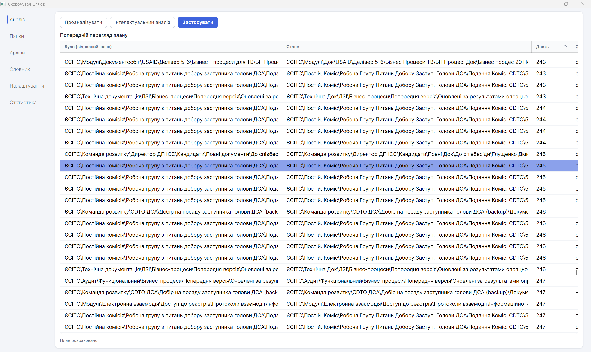
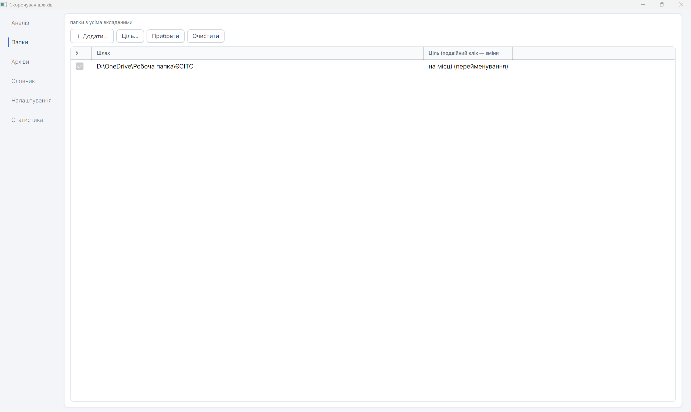
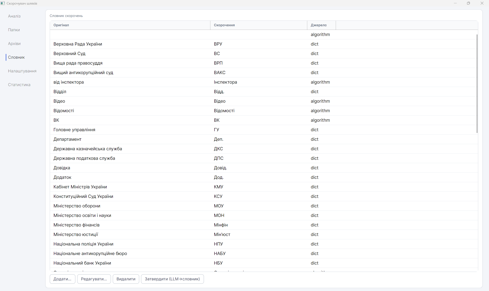
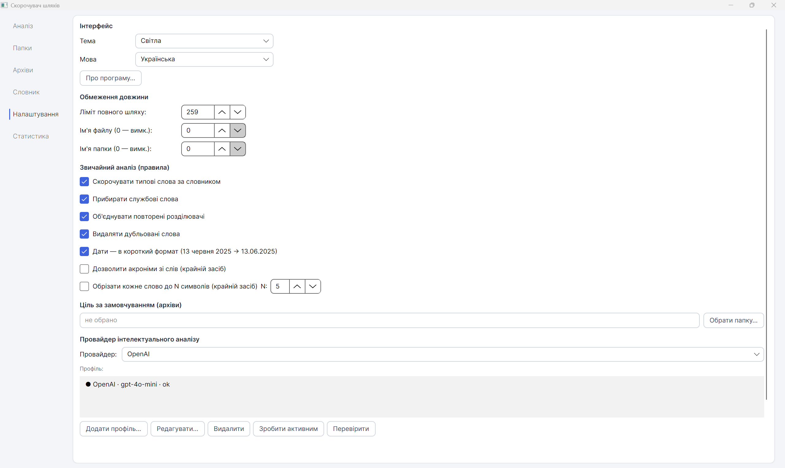
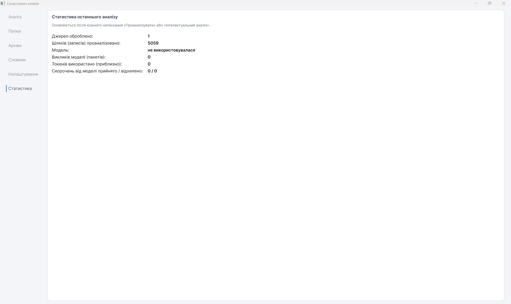

# PathShortener — Скорочувач шляхів

[](LICENSE)


**🇺🇦 Українська** · [🇬🇧 English](#-english)

Буває, що Windows не дає розпакувати архів або скопіювати папку й пише
**«Занадто довге ім'я файлу»**. Це через ліміт довжини шляху (259 символів).

**PathShortener** розв'язує це просто: перед розпакуванням він **робить назви папок і
файлів коротшими — але зрозумілими** — щоб усе вмістилося й нічого не загубилося.
Дати, прізвища та номери документів лишаються недоторканими.

## Що вміє

- 📦 **Розпаковує архіви** ZIP / 7z / RAR і **впорядковує папки**, вкладаючись у ліміт Windows.
- ✂️ **Скорочує розумно**: лишає зрозумілі слова та звичні абревіатури (ВРП, КМУ, ВККСУ),
  а не перетворює назви на нечитабельний набір літер.
- 🔒 **Не чіпає важливе**: дати, прізвища з ініціалами, номери й розширення файлів — цілі.
- 🤖 **Працює як без інтернету** (за правилами й словником), **так і з ШІ** для кращих назв —
  Ollama (локально), Claude, OpenAI, Grok або Gemini.
- 👀 **Показує план перед застосуванням** — можна виправити будь-яку назву вручну;
  попереджає про конфлікти й не дає зіпсувати дані.
- 📝 **Веде журнал змін** — будь-яке скорочення можна відстежити й відкотити.
- 🌐 **Українська та англійська** мови, **світла й темна** теми.

## Скриншоти

**Аналіз — попередній перегляд плану**


**Папки**


**Словник**


**Налаштування**


**Статистика**


## Встановлення

1. Відкрийте [**Releases**](https://github.com/teraxis/PathShortener/releases).
2. Завантажте:
   - **`PathShortener-portable.zip`** — самодостатній, працює одразу;
   - або **`PathShortener-compact.zip`** — легший, потребує
     [.NET 8 Desktop Runtime](https://dotnet.microsoft.com/download/dotnet/8.0).
3. Розпакуйте й запустіть `PathShortener.exe`.

Для роботи з архівами потрібен [**7-Zip**](https://www.7-zip.org/).
ШІ-скорочення — за бажанням: [**Ollama**](https://ollama.com/) з моделлю або API-ключ
одного з провайдерів. Без них програма скорочує за правилами.

## Збірка з коду

```bash
git clone https://github.com/teraxis/PathShortener.git
cd PathShortener
dotnet run --project gui/PathShortener.Gui.csproj
```

- `src/PathShortener.Core` — ядро (скорочення, ШІ, кеш, конфлікти), без UI.
- `src/PathShortener.Verify` — тести ядра.
- `gui` — інтерфейс Avalonia.

Стек: **C# / .NET 8**, **Avalonia 11**, 7-Zip.

## Ліцензія та автор

[MIT](LICENSE) — вільне використання, зміна й поширення.

**Білик Ігор (Bilyk Ihor)** · [teraxis@gmail.com](mailto:teraxis@gmail.com) ·
[github.com/teraxis](https://github.com/teraxis)

---
---

# 🇬🇧 English

[🇺🇦 Українська](#pathshortener--скорочувач-шляхів) · **🇬🇧 English**

Sometimes Windows refuses to extract an archive or copy a folder and says
**"The file name is too long."** That's the path length limit (259 characters).

**PathShortener** fixes this simply: before extracting, it **makes folder and file names
shorter — but still readable** — so everything fits and nothing gets lost. Dates,
surnames and document numbers stay untouched.

## What it does

- 📦 **Extracts** ZIP / 7z / RAR archives and **organizes folders** within the Windows limit.
- ✂️ **Shortens smartly**: keeps meaningful words and common abbreviations instead of
  turning names into an unreadable jumble of letters.
- 🔒 **Keeps what matters**: dates, surnames with initials, numbers and file extensions intact.
- 🤖 **Works offline** (rules + dictionary) **and with AI** for better names —
  Ollama (local), Claude, OpenAI, Grok or Gemini.
- 👀 **Shows the plan before applying** — edit any name by hand; warns about conflicts
  and won't let you corrupt data.
- 📝 **Keeps a change log** — every shortening can be traced and reverted.
- 🌐 **Ukrainian and English** languages, **light and dark** themes.

## Screenshots

See the screenshots above (Analysis, Folders, Dictionary, Settings, Statistics).

## Install

1. Open [**Releases**](https://github.com/teraxis/PathShortener/releases).
2. Download **`PathShortener-portable.zip`** (self-contained) or **`PathShortener-compact.zip`**
   (needs the [.NET 8 Desktop Runtime](https://dotnet.microsoft.com/download/dotnet/8.0)).
3. Unzip and run `PathShortener.exe`.

[**7-Zip**](https://www.7-zip.org/) is required for archives. AI shortening is optional:
[**Ollama**](https://ollama.com/) with a model, or an API key for one of the providers.
Without them, the app shortens using rules.

## Build from source

```bash
git clone https://github.com/teraxis/PathShortener.git
cd PathShortener
dotnet run --project gui/PathShortener.Gui.csproj
```

- `src/PathShortener.Core` — core (shortening, AI, cache, conflicts), no UI.
- `src/PathShortener.Verify` — core tests.
- `gui` — Avalonia UI.

Stack: **C# / .NET 8**, **Avalonia 11**, 7-Zip.

## License & author

[MIT](LICENSE) — free to use, modify and distribute.

**Bilyk Ihor (Білик Ігор)** · [teraxis@gmail.com](mailto:teraxis@gmail.com) ·
[github.com/teraxis](https://github.com/teraxis)
